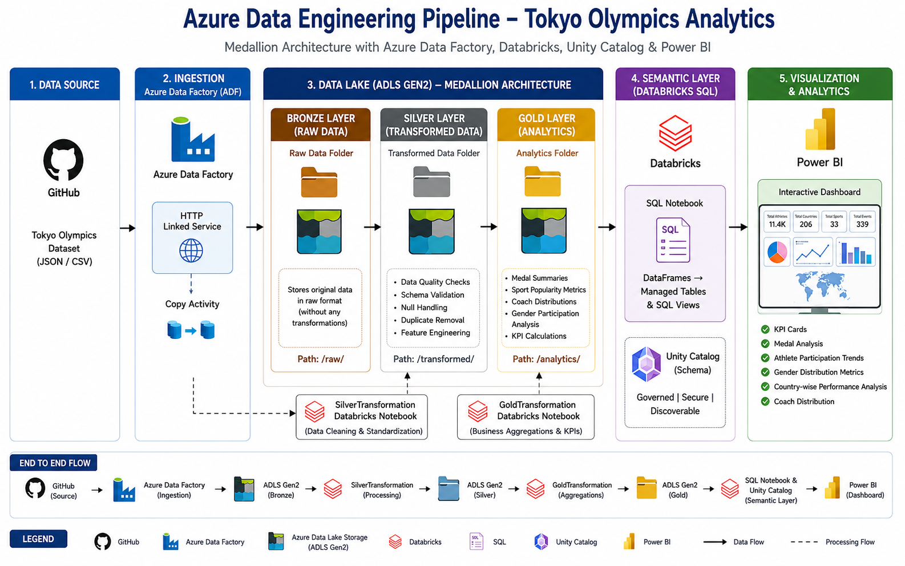
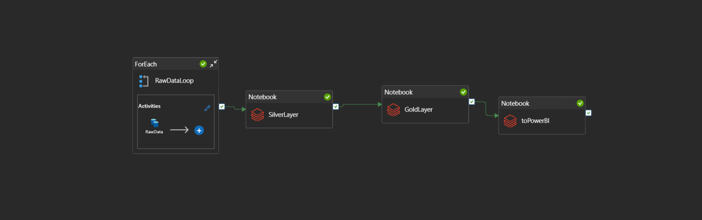

# End-to-End Azure Data Engineering & Analytics Platform using Tokyo Olympics 2021 Dataset

[](https://azure.microsoft.com/)
[](https://azure.microsoft.com/services/data-factory/)
[](https://www.databricks.com/)
[](https://learn.microsoft.com/en-us/azure/databricks/data-governance/unity-catalog/)
[](https://powerbi.microsoft.com/)
[](https://www.python.org/)

An end-to-end cloud-native data engineering and analytics solution built on Microsoft Azure using the Tokyo Olympics 2021 dataset. The project implements a complete **Medallion Architecture (Bronze → Silver → Gold)** utilizing Azure Data Factory, Azure Data Lake Storage Gen2, Azure Databricks, Unity Catalog, and Power BI to transform raw Olympic data into business-ready analytical insights.

## 📑 Table of Contents
- [📌 Project Overview](#-project-overview)
- [🎯 Business Objectives](#-business-objectives)
- [🛠️ Tools & Technologies](#️-tools--technologies)
- [📐 Data Platform & Solution Architecture](#-data-platform--solution-architecture)
- [📂 Dataset Overview](#-dataset-overview)
- [⚙️ Step-by-Step Pipeline Implementation](#️-step-by-step-pipeline-implementation)
- [📊 Dashboard Insights](#-dashboard-insights)
- [📁 Project Structure](#-project-structure)
- [🚀 Skills Demonstrated](#-skills-demonstrated)
- [📜 License](#-license)
- [👨‍💻 Author](#-author)

---

## 📌 Project Overview

Modern organizations require reliable and scalable analytical platforms capable of transforming raw operational data into meaningful business insights.

This project demonstrates the implementation of a cloud-native Azure Data Engineering platform using Olympic participation and medal datasets. The solution follows industry-standard **Medallion Architecture** principles, enabling the structured movement of data through progressively refined layers.

Raw datasets are seamlessly ingested into Azure Data Lake Storage using Azure Data Factory, cleansed and transformed using PySpark in Azure Databricks, strictly governed through Unity Catalog, and finally visualized using interactive Power BI dashboards.

---

## 🎯 Business Objectives

* **Medal Analysis:** Identify and rank top-performing countries based on total Olympic medal counts.
* **Athlete Participation Analysis:** Measure and track participation trends across various Olympic disciplines.
* **Gender Representation Analysis:** Analyze the ratio of female and male participation across different sports.
* **Coach Distribution Analysis:** Understand coaching allocations and staff distribution across participating countries.
* **Executive KPI Reporting:** Provide leadership-level Olympic participation metrics through intuitive, interactive dashboards.

---

## 🛠️ Tools & Technologies

* **Data Ingestion & Orchestration:** Azure Data Factory (ADF)
* **Cloud Storage / Data Lake:** Azure Data Lake Storage Gen2 (ADLS Gen2)
* **Data Governance & Access:** Unity Catalog, Storage Credentials, External Locations, Volumes
* **Data Processing & Transformation:** Azure Databricks, PySpark, Spark SQL
* **Analytics & Reporting:** Power BI
* **Security & Authentication:** Microsoft Entra ID (RBAC), Azure Key Vault

---

## 📐 Data Platform & Solution Architecture

The infrastructure adopts a highly resilient modern data lakehouse design, moving fluidly through specialized layers.

### 🧱 System Architecture Blueprint

**Data Flow:** `GitHub Dataset` → `Azure Data Factory` → `ADLS Gen2` → `Unity Catalog Volume` → `Azure Databricks` *(Bronze → Silver → Gold)* → `SQL Views` → `Power BI`

#### 1. End-to-End Core Infrastructure


#### 2. Multi-Tier Medallion Execution Lifecycle


---

## 📂 Dataset Overview

The source system captures complex Olympic activity across multiple dimensional boundaries. The primary datasets ingested are:

* `Athletes.csv`: Demographic and participation data of individual competitors.
* `Coaches.csv`: Managerial and coaching staff allocations per country/discipline.
* `Medals.csv`: Final podium results, categorizing Gold, Silver, and Bronze achievements.
* `Teams.csv`: Team-based event participation metrics.
* `EntriesGender.csv`: Aggregated counts of male and female participants per discipline.

---

## ⚙️ Step-by-Step Pipeline Implementation

### Phase 1: Data Ingestion & Orchestration (Azure Data Factory)

The pipeline begins by securely ingesting the raw Olympic datasets directly from GitHub into Azure Data Lake Storage Gen2.
* **Activities Used:** Linked Services, Datasets, Parameterization, and scalable `Copy Data` activities.
* **Outcome:** Source CSV files are successfully loaded and partitioned into the **Raw Data (Bronze)** layer.

### Phase 2: Data Validation & Transformation (Azure Databricks)

The `SilverTransformation` Databricks notebook curates the raw data into a reliable source of truth.
* **Operations:** Schema Validation, Null Analysis, Duplicate Detection, Data Cleansing, and Data Standardization using optimized PySpark.
* **Outcome:** Cleansed and transformed datasets are written in performant formats to the **Transformed Data (Silver)** layer.

### Phase 3: Analytics Dataset Generation (Gold Layer)

The `GoldTransformation` Databricks notebook structures the final business metrics ready for executive analytical consumption. Generates specialized dimension/fact tables:
* `country_medal_summary`
* `sport_popularity`
* `coach_distribution`
* `gender_distribution`
* `overview`

### Phase 4: Data Publishing & Governance (Unity Catalog)

Centralized governance is enforced to secure the analytical outputs.
* **Unity Catalog Components:** Catalog, Schema, and Volume creation.
* **SQL Operations:** Tables and views are published for downstream consumption.
* **Views Created:** `vw_country_medals`, `vw_sport_popularity`, `vw_gender_distribution`, `vw_coach_distribution`.

### Phase 5: Business Intelligence & Reporting (Power BI)

Power BI connects directly to the published SQL Views to construct clean semantic layers.
* **KPI Cards:** Total Athletes, Total Countries, Total Disciplines, Total Medals.
* **Visualizations:** Top Countries by Medal Count, Sports Popularity, Gender Participation, Coach Distribution.
* **Interactive Filters:** Drill-down capabilities by NOC (National Olympic Committee), Discipline, and Gender.

---

## 📊 Dashboard Insights

The final Power BI dashboard enables end-users and stakeholders to:
* Dynamically analyze country medal performance and pinpoint dominant athletic programs.
* Explore athlete participation trends across various Olympic cycles and disciplines.
* Understand gender representation to evaluate diversity and inclusion in specific sports.
* Evaluate coaching distribution to find correlations between staff allocation and medal yields.
* Monitor high-level Olympic KPIs at a glance.

---

## 📁 Project Structure

```text
Tokyo-Olympics-Azure-DE/
├── Data Lake Storage (Unity Catalog Volume)
│   ├── Raw Data/
│   │   ├── Athletes.csv
│   │   ├── Coaches.csv
│   │   ├── Medals.csv
│   │   ├── Teams.csv
│   │   └── EntriesGender.csv
│   ├── Transformed Data/
│   │   ├── Athletes/
│   │   ├── Coaches/
│   │   ├── Medals/
│   │   ├── Teams/
│   │   └── EntriesGender/
│   └── Analytics/
│       ├── country_medal_summary/
│       ├── sport_popularity/
│       ├── coach_distribution/
│       ├── gender_distribution/
│       └── overview/
├── Databricks Workspace
│   ├── SilverTransformation.py
│   ├── GoldTransformation.py
│   └── SQL_Setup.sql
├── Power BI
│   └── TokyoOlympicsDashboard.pbix
└── README.md
```
---

## 🚀 Skills Demonstrated

* **Azure Cloud:** Azure Data Factory, Azure Data Lake Storage Gen2, Azure Databricks.
* **Data Engineering:** ETL / ELT Pipelines, Medallion Architecture, Data Quality Validation, Dimensional Data Modeling.
* **Big Data Computation:** PySpark, Spark SQL, Distributed Data Processing.
* **Data Governance:** Unity Catalog, Role-Based Access Control (RBAC), External Locations, Volumes.
* **Analytics & BI:** Power BI, KPI Design, Dashboard Development, DAX.

---

## 📜 License

This project is open-source and available under the [MIT License](LICENSE).

---

## 👨‍💻 Author

**Krishna Kothawale** *Backend Support Engineer | SQL Developer | Aspiring Data Engineer* [LinkedIn](https://linkedin.com/in/) | [GitHub](https://github.com/)
